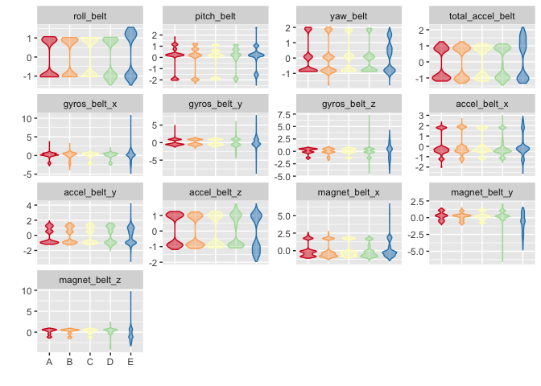
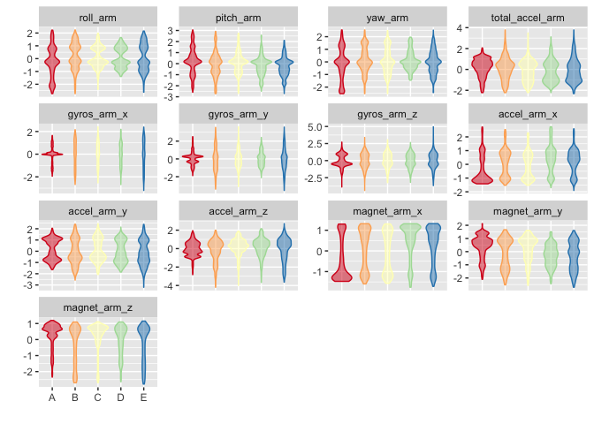
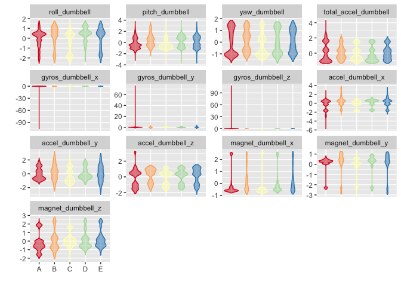
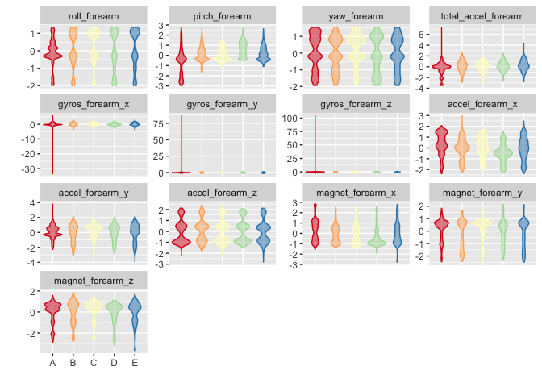

# Coursera: Practical Machine Learning Assignment: Prediction Assignment Writeup
Jeff Carter [GitHub](https://github.com/jmacarter/Practical_Machine_Learning)  


```
## Run time: 2016-05-26 09:07:09
## R version: R version 3.3.0 (2016-05-03)
```


This document establishes a stepwise description of the analysis performed for the prediction assignment of the Coursera's Practical Machine Learning course. This project uses data from the accelerometers of fitness devices of six participants to determine the manner in which they performed a particular exercise. 


Libraries used in the analysis will be loaded first. A seed value is also set at this time.

```
## Loading required package: lattice
```

```
## Loading required package: ggplot2
```

```
## Loading required package: foreach
```

```
## Loading required package: iterators
```

# Prepare the datasets
The first step is to download and preprocess the training and test data for this project. As noted in Reproducible Research lectures, the download date will also be recorded when the data is downloaded, for posterity.

```r
require(data.table)
url <- "https://d396qusza40orc.cloudfront.net/predmachlearn/pml-training.csv"
D <- fread(url)

# record the download date, as mentioned in lectures
DownloadDate <- date()
sink("./data/download_date_training.txt")
cat("Date training data downloaded: ")
```

```
## Date training data downloaded:
```

```r
cat(DownloadDate)
```

```
## Thu May 26 09:07:20 2016
```

```r
sink()

url <- "https://d396qusza40orc.cloudfront.net/predmachlearn/pml-testing.csv"
DTest <- fread(url)

# record the download date, as mentioned in lectures
DownloadDate <- date()
sink("./data/download_date_testing.txt")
cat("Date testing data downloaded: ")
```

```
## Date testing data downloaded:
```

```r
cat(DownloadDate)
```

```
## Thu May 26 09:07:21 2016
```

```r
sink()
```

## Identify predictor candidates in the testing dataset
We need to identify variables in the test dataset without missing or NA values; these will be suitable **predictor candidates**.

```r
isAnyMissing <- sapply(DTest, function (x) any(is.na(x) | x == ""))
isPredictor <- !isAnyMissing & grepl("belt|[^(fore)]arm|dumbbell|forearm", names(isAnyMissing))
predCandidates <- names(isAnyMissing)[isPredictor]
predCandidates
```

```
##  [1] "roll_belt"            "pitch_belt"           "yaw_belt"            
##  [4] "total_accel_belt"     "gyros_belt_x"         "gyros_belt_y"        
##  [7] "gyros_belt_z"         "accel_belt_x"         "accel_belt_y"        
## [10] "accel_belt_z"         "magnet_belt_x"        "magnet_belt_y"       
## [13] "magnet_belt_z"        "roll_arm"             "pitch_arm"           
## [16] "yaw_arm"              "total_accel_arm"      "gyros_arm_x"         
## [19] "gyros_arm_y"          "gyros_arm_z"          "accel_arm_x"         
## [22] "accel_arm_y"          "accel_arm_z"          "magnet_arm_x"        
## [25] "magnet_arm_y"         "magnet_arm_z"         "roll_dumbbell"       
## [28] "pitch_dumbbell"       "yaw_dumbbell"         "total_accel_dumbbell"
## [31] "gyros_dumbbell_x"     "gyros_dumbbell_y"     "gyros_dumbbell_z"    
## [34] "accel_dumbbell_x"     "accel_dumbbell_y"     "accel_dumbbell_z"    
## [37] "magnet_dumbbell_x"    "magnet_dumbbell_y"    "magnet_dumbbell_z"   
## [40] "roll_forearm"         "pitch_forearm"        "yaw_forearm"         
## [43] "total_accel_forearm"  "gyros_forearm_x"      "gyros_forearm_y"     
## [46] "gyros_forearm_z"      "accel_forearm_x"      "accel_forearm_y"     
## [49] "accel_forearm_z"      "magnet_forearm_x"     "magnet_forearm_y"    
## [52] "magnet_forearm_z"
```
Belt, arm, dumbbell, and forearm variables lack missing values in the test dataset and will be used as predictors.

## Subset the training dataset
We next subset the primary dataset to include only the predictor candidates identified above, and the outcome variable, `classe` and cast `classe` as a factor.

```r
varToInclude <- c("classe", predCandidates)
D <- D[, varToInclude, with=FALSE]
dim(D)
```

```
## [1] 19622    53
```

```r
names(D)
```

```
##  [1] "classe"               "roll_belt"            "pitch_belt"          
##  [4] "yaw_belt"             "total_accel_belt"     "gyros_belt_x"        
##  [7] "gyros_belt_y"         "gyros_belt_z"         "accel_belt_x"        
## [10] "accel_belt_y"         "accel_belt_z"         "magnet_belt_x"       
## [13] "magnet_belt_y"        "magnet_belt_z"        "roll_arm"            
## [16] "pitch_arm"            "yaw_arm"              "total_accel_arm"     
## [19] "gyros_arm_x"          "gyros_arm_y"          "gyros_arm_z"         
## [22] "accel_arm_x"          "accel_arm_y"          "accel_arm_z"         
## [25] "magnet_arm_x"         "magnet_arm_y"         "magnet_arm_z"        
## [28] "roll_dumbbell"        "pitch_dumbbell"       "yaw_dumbbell"        
## [31] "total_accel_dumbbell" "gyros_dumbbell_x"     "gyros_dumbbell_y"    
## [34] "gyros_dumbbell_z"     "accel_dumbbell_x"     "accel_dumbbell_y"    
## [37] "accel_dumbbell_z"     "magnet_dumbbell_x"    "magnet_dumbbell_y"   
## [40] "magnet_dumbbell_z"    "roll_forearm"         "pitch_forearm"       
## [43] "yaw_forearm"          "total_accel_forearm"  "gyros_forearm_x"     
## [46] "gyros_forearm_y"      "gyros_forearm_z"      "accel_forearm_x"     
## [49] "accel_forearm_y"      "accel_forearm_z"      "magnet_forearm_x"    
## [52] "magnet_forearm_y"     "magnet_forearm_z"
```

```r
D <- D[, classe := factor(D[, classe])]
D[, .N, classe]
```

```
##    classe    N
## 1:      A 5580
## 2:      B 3797
## 3:      C 3422
## 4:      D 3216
## 5:      E 3607
```


We then split the primary dataset into a 60% training and 40% probing dataset.

```r
require(caret)
inTrain <- createDataPartition(D$classe, p=0.6)
DTrain <- D[inTrain[[1]]]
DProbe <- D[-inTrain[[1]]]
```

Next, we center and scale the prediction variables, and apply the centering and scaling to the probing dataset.

```r
X <- DTrain[, predCandidates, with=FALSE]
preProc <- preProcess(X)
preProc
```

```
## Created from 11776 samples and 52 variables
## 
## Pre-processing:
##   - centered (52)
##   - ignored (0)
##   - scaled (52)
```

```r
XCS <- predict(preProc, X)
DTrainCS <- data.table(data.frame(classe = DTrain[, classe], XCS))

X <- DProbe[, predCandidates, with=FALSE]
XCS <- predict(preProc, X)
DProbeCS <- data.table(data.frame(classe = DProbe[, classe], XCS))
```

At this time, we also look at the variance, checking for near-zero variance.

```r
nzv <- nearZeroVar(DTrainCS, saveMetrics=TRUE)
if (any(nzv$nzv)) nzv else message("No variables with near-zero variance")
```

```
## No variables with near-zero variance
```

We'll visualize the prediction variables, by group.

```r
histGroup <- function (data, regex) {
  col <- grep(regex, names(data))
  col <- c(col, which(names(data) == "classe"))
  require(reshape2)
  n <- nrow(data)
  DMelted <- melt(data[, col, with=FALSE][, rownum := seq(1, n)], id.vars=c("rownum", "classe"))
  require(ggplot2)
  ggplot(DMelted, aes(x=classe, y=value)) +
    geom_violin(aes(color=classe, fill=classe), alpha=1/2) +
#     geom_jitter(aes(color=classe, fill=classe), alpha=1/10) +
#     geom_smooth(aes(group=1), method="gam", color="black", alpha=1/2, size=2) +
    facet_wrap(~ variable, scale="free_y") +
    scale_color_brewer(palette="Spectral") +
    scale_fill_brewer(palette="Spectral") +
    labs(x="", y="") +
    theme(legend.position="none")
}
histGroup(DTrainCS, "belt")
```

```
## Loading required package: reshape2
```

```
## 
## Attaching package: 'reshape2'
```

```
## The following objects are masked from 'package:data.table':
## 
##     dcast, melt
```

<!-- -->

```r
histGroup(DTrainCS, "[^(fore)]arm")
```

<!-- -->

```r
histGroup(DTrainCS, "dumbbell")
```

<!-- -->

```r
histGroup(DTrainCS, "forearm")
```

<!-- -->

# Train a prediction model
Using random forest methodology, the out-of-sample error should be small. We'll estimate the error using the 40% probing sample.


Set up the parallel clusters, and establish control parameters.

```r
require(parallel)
require(doParallel)
cl <- makeCluster(detectCores() - 1)
registerDoParallel(cl)

ctrl <- trainControl(classProbs=TRUE,
                     savePredictions=TRUE,
                     allowParallel=TRUE)
```

Then fit out model over the training parameters.

```r
method <- "rf"
system.time(trainingModel <- train(classe ~ ., data=DTrainCS, method=method))
```

```
## Loading required package: randomForest
```

```
## randomForest 4.6-12
```

```
## Type rfNews() to see new features/changes/bug fixes.
```

```
## 
## Attaching package: 'randomForest'
```

```
## The following object is masked from 'package:ggplot2':
## 
##     margin
```

```
##     user   system  elapsed 
##   52.206    0.587 2735.913
```

Finally, we terminate the clustering.

```r
stopCluster(cl)
```

Now, we evaluate our model using the training and probing datasets, and present the final model.
## Evaluate the model on the training dataset

```r
trainingModel
```

```
## Random Forest 
## 
## 11776 samples
##    52 predictor
##     5 classes: 'A', 'B', 'C', 'D', 'E' 
## 
## No pre-processing
## Resampling: Bootstrapped (25 reps) 
## Summary of sample sizes: 11776, 11776, 11776, 11776, 11776, 11776, ... 
## Resampling results across tuning parameters:
## 
##   mtry  Accuracy   Kappa    
##    2    0.9859140  0.9821711
##   27    0.9870485  0.9836089
##   52    0.9790227  0.9734515
## 
## Accuracy was used to select the optimal model using  the largest value.
## The final value used for the model was mtry = 27.
```

```r
hat <- predict(trainingModel, DTrainCS)
confusionMatrix(hat, DTrain[, classe])
```

```
## Confusion Matrix and Statistics
## 
##           Reference
## Prediction    A    B    C    D    E
##          A 3348    0    0    0    0
##          B    0 2279    0    0    0
##          C    0    0 2054    0    0
##          D    0    0    0 1930    0
##          E    0    0    0    0 2165
## 
## Overall Statistics
##                                      
##                Accuracy : 1          
##                  95% CI : (0.9997, 1)
##     No Information Rate : 0.2843     
##     P-Value [Acc > NIR] : < 2.2e-16  
##                                      
##                   Kappa : 1          
##  Mcnemar's Test P-Value : NA         
## 
## Statistics by Class:
## 
##                      Class: A Class: B Class: C Class: D Class: E
## Sensitivity            1.0000   1.0000   1.0000   1.0000   1.0000
## Specificity            1.0000   1.0000   1.0000   1.0000   1.0000
## Pos Pred Value         1.0000   1.0000   1.0000   1.0000   1.0000
## Neg Pred Value         1.0000   1.0000   1.0000   1.0000   1.0000
## Prevalence             0.2843   0.1935   0.1744   0.1639   0.1838
## Detection Rate         0.2843   0.1935   0.1744   0.1639   0.1838
## Detection Prevalence   0.2843   0.1935   0.1744   0.1639   0.1838
## Balanced Accuracy      1.0000   1.0000   1.0000   1.0000   1.0000
```

## Evaluate the model on the probing dataset

```r
hat <- predict(trainingModel, DProbeCS)
confusionMatrix(hat, DProbeCS[, classe])
```

```
## Confusion Matrix and Statistics
## 
##           Reference
## Prediction    A    B    C    D    E
##          A 2229   32    1    1    0
##          B    3 1481   13    1    1
##          C    0    5 1347   17    3
##          D    0    0    7 1265    6
##          E    0    0    0    2 1432
## 
## Overall Statistics
##                                           
##                Accuracy : 0.9883          
##                  95% CI : (0.9856, 0.9905)
##     No Information Rate : 0.2845          
##     P-Value [Acc > NIR] : < 2.2e-16       
##                                           
##                   Kappa : 0.9852          
##  Mcnemar's Test P-Value : NA              
## 
## Statistics by Class:
## 
##                      Class: A Class: B Class: C Class: D Class: E
## Sensitivity            0.9987   0.9756   0.9846   0.9837   0.9931
## Specificity            0.9939   0.9972   0.9961   0.9980   0.9997
## Pos Pred Value         0.9850   0.9880   0.9818   0.9898   0.9986
## Neg Pred Value         0.9995   0.9942   0.9968   0.9968   0.9984
## Prevalence             0.2845   0.1935   0.1744   0.1639   0.1838
## Detection Rate         0.2841   0.1888   0.1717   0.1612   0.1825
## Detection Prevalence   0.2884   0.1911   0.1749   0.1629   0.1828
## Balanced Accuracy      0.9963   0.9864   0.9904   0.9908   0.9964
```
## Display the final model


```r
varImp(trainingModel)
```

```
## rf variable importance
## 
##   only 20 most important variables shown (out of 52)
## 
##                      Overall
## roll_belt             100.00
## pitch_forearm          60.03
## yaw_belt               53.18
## pitch_belt             44.39
## magnet_dumbbell_z      43.97
## magnet_dumbbell_y      43.34
## roll_forearm           42.75
## accel_dumbbell_y       22.17
## accel_forearm_x        17.95
## magnet_dumbbell_x      17.62
## roll_dumbbell          17.61
## accel_dumbbell_z       14.99
## magnet_forearm_z       14.42
## magnet_belt_z          14.12
## accel_belt_z           13.90
## total_accel_dumbbell   12.91
## magnet_belt_y          11.96
## yaw_arm                10.97
## gyros_belt_z           10.65
## magnet_belt_x          10.28
```

```r
trainingModel$finalModel
```

```
## 
## Call:
##  randomForest(x = x, y = y, mtry = param$mtry) 
##                Type of random forest: classification
##                      Number of trees: 500
## No. of variables tried at each split: 27
## 
##         OOB estimate of  error rate: 0.76%
## Confusion matrix:
##      A    B    C    D    E class.error
## A 3344    2    0    0    2 0.001194743
## B   21 2250    7    1    0 0.012724879
## C    0   11 2038    5    0 0.007789679
## D    0    2   26 1901    1 0.015025907
## E    0    1    3    8 2153 0.005542725
```

```r
#save the training model for use with the testing data
save(trainingModel, file="trainingModel.RData")
```

# Predict on the test data
Now we can begin prediction on the testing dataset, using the model we just saved

```r
load(file="trainingModel.RData", verbose=TRUE)
```

```
## Loading objects:
##   trainingModel
```

We determine the predictions and evaluate.

```r
DTestCS <- predict(preProc, DTest[, predCandidates, with=FALSE])
hat <- predict(trainingModel, DTestCS)
DTest <- cbind(hat , DTest)
subset(DTest, select=names(DTest)[grep("belt|[^(fore)]arm|dumbbell|forearm", names(DTest), invert=TRUE)])
```

```
##     hat V1 user_name raw_timestamp_part_1 raw_timestamp_part_2
##  1:   B  1     pedro           1323095002               868349
##  2:   A  2    jeremy           1322673067               778725
##  3:   B  3    jeremy           1322673075               342967
##  4:   A  4    adelmo           1322832789               560311
##  5:   A  5    eurico           1322489635               814776
##  6:   E  6    jeremy           1322673149               510661
##  7:   D  7    jeremy           1322673128               766645
##  8:   B  8    jeremy           1322673076                54671
##  9:   A  9  carlitos           1323084240               916313
## 10:   A 10   charles           1322837822               384285
## 11:   B 11  carlitos           1323084277                36553
## 12:   C 12    jeremy           1322673101               442731
## 13:   B 13    eurico           1322489661               298656
## 14:   A 14    jeremy           1322673043               178652
## 15:   E 15    jeremy           1322673156               550750
## 16:   E 16    eurico           1322489713               706637
## 17:   A 17     pedro           1323094971               920315
## 18:   B 18  carlitos           1323084285               176314
## 19:   B 19     pedro           1323094999               828379
## 20:   B 20    eurico           1322489658               106658
##       cvtd_timestamp new_window num_window problem_id
##  1: 05/12/2011 14:23         no         74          1
##  2: 30/11/2011 17:11         no        431          2
##  3: 30/11/2011 17:11         no        439          3
##  4: 02/12/2011 13:33         no        194          4
##  5: 28/11/2011 14:13         no        235          5
##  6: 30/11/2011 17:12         no        504          6
##  7: 30/11/2011 17:12         no        485          7
##  8: 30/11/2011 17:11         no        440          8
##  9: 05/12/2011 11:24         no        323          9
## 10: 02/12/2011 14:57         no        664         10
## 11: 05/12/2011 11:24         no        859         11
## 12: 30/11/2011 17:11         no        461         12
## 13: 28/11/2011 14:14         no        257         13
## 14: 30/11/2011 17:10         no        408         14
## 15: 30/11/2011 17:12         no        779         15
## 16: 28/11/2011 14:15         no        302         16
## 17: 05/12/2011 14:22         no         48         17
## 18: 05/12/2011 11:24         no        361         18
## 19: 05/12/2011 14:23         no         72         19
## 20: 28/11/2011 14:14         no        255         20
```
